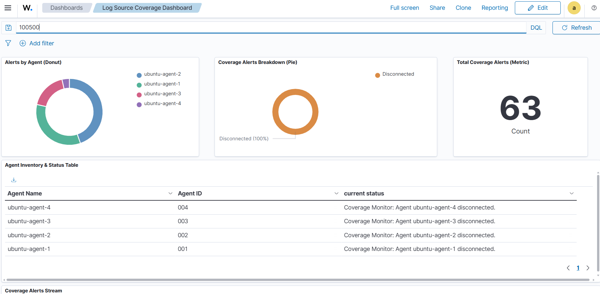
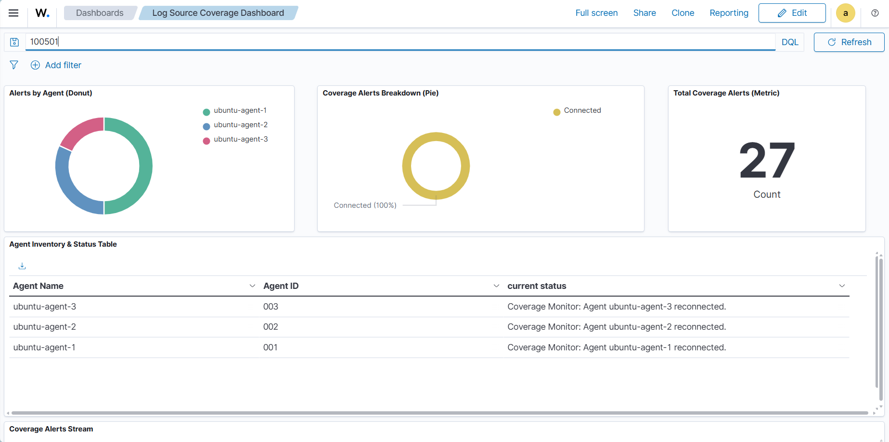
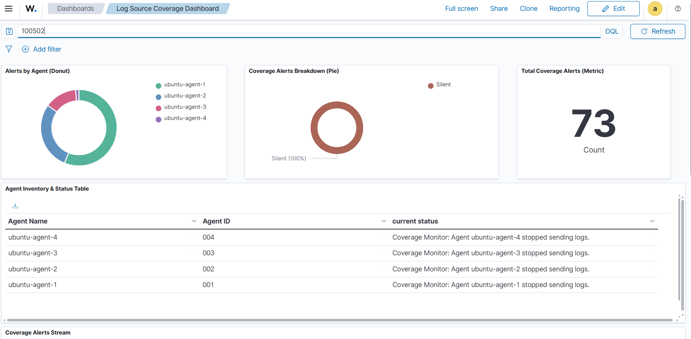
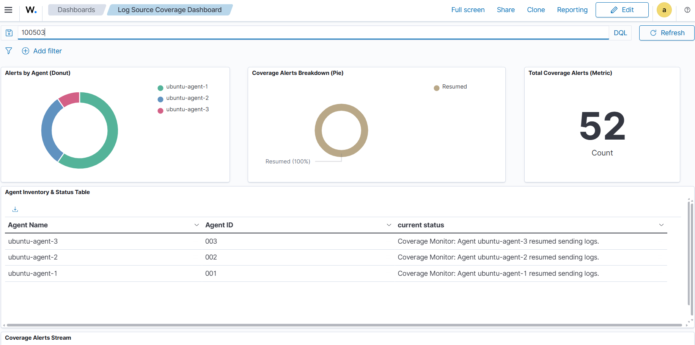
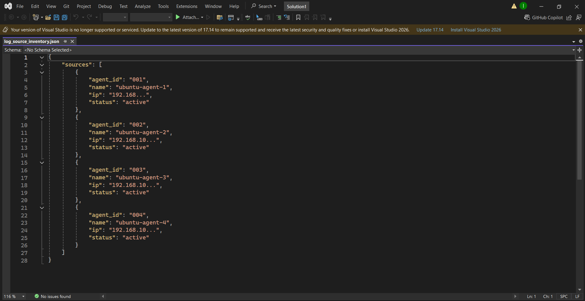
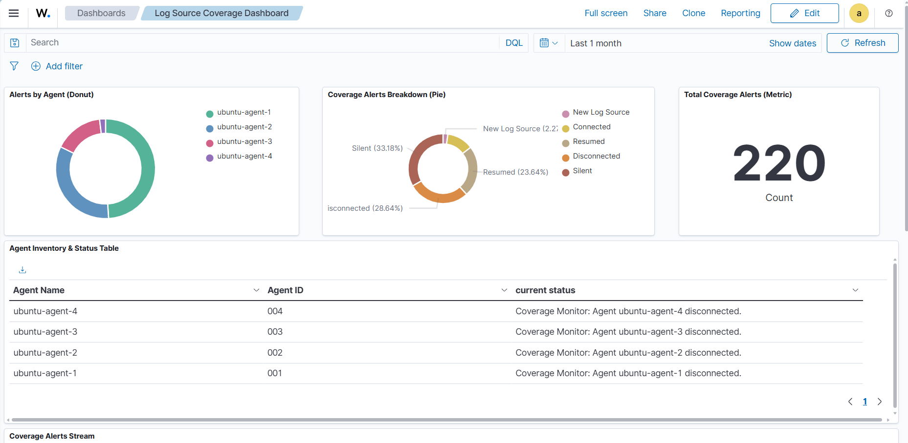

# Log Source Coverage Monitoring for Wazuh

A Python-based monitoring layer built on top of Wazuh to monitor log-source availability, event activity, and newly discovered Wazuh agents.

## Overview

Log Source Coverage Monitoring continuously monitors Wazuh agents from three perspectives:

1. **Heartbeat Monitoring** – determines whether an agent is connected or disconnected.
2. **Zero-Event Monitoring** – detects agents that are connected but have stopped generating events.
3. **New Source Detection** – identifies Wazuh agents that are not currently present in the approved log-source inventory.

When a previously unknown Wazuh agent is detected, the system can automatically register it in the log-source inventory.

Monitoring events are generated as JSON logs and processed by custom Wazuh rules so that important coverage events appear as alerts in the Wazuh Dashboard.

---

## Architecture


### Architecture Flow

```text
                 ┌──────────────────────┐
                 │     Ubuntu Agents    │
                 │    001  002  003...  │
                 └──────────┬───────────┘
                            │
                       Wazuh Events
                            │
                            ▼
                 ┌──────────────────────┐
                 │    Wazuh Manager     │
                 │   Agent API / Logs   │
                 └───────┬───────┬──────┘
                         │       │
                    API  │       │ archives.json
                         │       │
                         ▼       ▼
                 ┌──────────────────────┐
                 │ Log Source Coverage  │
                 │    Python Service    │
                 ├──────────────────────┤
                 │ Heartbeat Monitor    │
                 │ Zero Event Monitor   │
                 │ New Source Detector  │
                 │ Archive Reader       │
                 │ Inventory Manager    │
                 └──────────┬───────────┘
                            │
                    JSON Monitoring Events
                            │
                            ▼
                 ┌──────────────────────┐
                 │ coverage_monitor.log │
                 └──────────┬───────────┘
                            │
                     Wazuh Logcollector
                            │
                            ▼
                 ┌──────────────────────┐
                 │    Custom Rules      │
                 │  local_rules.xml     │
                 └──────────┬───────────┘
                            │
                            ▼
                 ┌──────────────────────┐
                 │   Wazuh Dashboard    │
                 │       Alerts         │
                 └──────────────────────┘
```

---

## Features

- Heartbeat Monitoring
- Zero-Event Detection
- Automatic New Source Detection
- Automatic Inventory Registration
- Custom Wazuh Alerts
- Wazuh Dashboard Integration
- Configurable Monitoring Thresholds
- Automatic Recovery Detection
- JSON-based Monitoring Events
- Wazuh API Integration
- Wazuh Archive Analysis

---

## Monitoring Workflow

```text
Wazuh Agents
     │
     ▼
Wazuh Manager
     │
     ├──────────────► Wazuh API
     │
     └──────────────► archives.json
                            │
                            ▼
                    Archive Reader
                            │
          ┌─────────────────┼─────────────────┐
          │                 │                 │
          ▼                 ▼                 ▼
      Heartbeat         Zero Event       New Source
      Monitoring        Monitoring        Detection
          │                 │                 │
          └─────────────────┼─────────────────┘
                            ▼
                    Log Source Inventory
                            │
                            ▼
                    Monitoring JSON Logs
                            │
                            ▼
                     Wazuh Rules
                            │
                            ▼
                    Wazuh Dashboard
```

---

# Monitoring Modules

## 1. Heartbeat Monitor

The Heartbeat Monitor uses the Wazuh API to determine whether an agent is currently connected to the Wazuh Manager.

It detects:

- Healthy / Connected agents
- Disconnected agents
- Reconnection events

Example:

```text
Agent connected
      │
      ▼
Healthy
      │
      ▼
Heartbeat lost
      │
      ▼
Disconnected Alert
      │
      ▼
Agent reconnects
      │
      ▼
Recovery Alert
```

### Example Dashboard Alerts

- `Coverage Monitor: Agent ubuntu-agent-3 disconnected.`
- `Coverage Monitor: Agent ubuntu-agent-3 reconnected.`

### Screenshot





---

## 2. Zero-Event Monitor

An agent may remain connected to Wazuh while no longer producing events.

The Zero-Event Monitor checks the timestamp of the latest event received from each healthy agent.

```text
Agent Status = Healthy
        │
        ▼
Check latest event
        │
        ├── Event received ──► Healthy
        │
        └── No event within threshold
                         │
                         ▼
                   Zero Event Warning
```

The inactivity threshold is configurable.

### Example

```text
Agent: ubuntu-agent-1
Status: active
Last Event: older than configured threshold
Result: Zero Event Warning
```

### Recovery

When the agent starts producing events again:

```text
Silent
  │
  ▼
New event received
  │
  ▼
Recovered
```

### Screenshots





---

## 3. New Source Detector

The New Source Detector identifies Wazuh agents that are not currently present in the configured inventory.

Example:

```text
Wazuh Agent 003 discovered
          │
          ▼
Is Agent 003 in inventory?
          │
       ┌──┴──┐
       │     │
      YES    NO
       │     │
       │     ▼
       │  New Source
       │  Detected
       │     │
       │     ▼
       │ Automatic
       │ Inventory
       │ Registration
       │
       ▼
    Existing Source
```

Example inventory entry:

```json
{
    "agent_id": "003",
    "name": "ubuntu-agent-3",
    "ip": "192.168.10.143",
    "status": "active"
}
```

### Screenshot


---

## 4. Archive Reader

The Archive Reader reads Wazuh archived events from:

```text
/var/ossec/logs/archives/archives.json
```

It is responsible for:

- Reading archived Wazuh events
- Tracking the latest event from each agent
- Identifying newly observed sources
- Providing event timestamps to the Zero-Event Monitor

---

## 5. Inventory Manager

The inventory manager maintains the approved log-source inventory.

The inventory contains:

- Agent ID
- Agent name
- IP address
- Status

Example:

```json
{
    "sources": [
        {
            "agent_id": "001",
            "name": "ubuntu-agent-1",
            "ip": "192.168.10.131",
            "status": "active"
        },
        {
            "agent_id": "002",
            "name": "ubuntu-agent-2",
            "ip": "192.168.10.141",
            "status": "active"
        }
    ]
}
```

### Screenshot



---

# Wazuh Integration

The monitoring service integrates with Wazuh through:

### Wazuh REST API

Used to retrieve current agent information and status.

### Wazuh archives.json

Used to determine the latest event received from each agent.

### Wazuh Logcollector

Reads the monitoring log generated by the project.

### Custom Wazuh Rules

Custom rules identify monitoring events and convert them into Wazuh alerts.

---

# Custom Dashboard Alerts

The project generates alerts for:

| Event | Description |
|---|---|
| Agent Disconnected | Wazuh agent heartbeat is lost |
| Agent Reconnected | Previously disconnected agent reconnects |
| Agent Stopped Sending Logs | Healthy agent exceeds zero-event threshold |
| Agent Resumed Sending Logs | Agent starts producing events again |
| New Log Source Registered | Previously unknown source is automatically added |

### Wazuh Dashboard



The dashboard displays alerts such as:

```text
Coverage Monitor: Agent ubuntu-agent-3 disconnected.
Coverage Monitor: Agent ubuntu-agent-3 reconnected.
Coverage Monitor: Agent ubuntu-agent-1 stopped sending logs.
Coverage Monitor: Agent ubuntu-agent-1 resumed sending logs.
```

---

# Example Monitoring Events

## Agent Disconnected

```json
{
    "event": "coverage_monitor",
    "level": "WARNING",
    "agent_id": "003",
    "agent_name": "ubuntu-agent-3",
    "heartbeat_state": "Disconnected",
    "message": "Agent heartbeat lost"
}
```

## Agent Reconnected

```json
{
    "event": "coverage_monitor",
    "level": "INFO",
    "agent_id": "003",
    "agent_name": "ubuntu-agent-3",
    "heartbeat_state": "Connected",
    "message": "Agent heartbeat restored"
}
```

## Zero Event

```json
{
    "event": "coverage_monitor",
    "level": "WARNING",
    "agent_id": "001",
    "agent_name": "ubuntu-agent-1",
    "zero_event_state": "Silent"
}
```

## New Source

```json
{
    "event": "coverage_monitor",
    "level": "WARNING",
    "agent_id": "003",
    "agent_name": "ubuntu-agent-3",
    "message": "New Wazuh source automatically registered"
}
```

---

# Project Structure

```text
LogSourceCoverage/
│
├── config/
│   ├── log_source_inventory.json
│   └── log_source_inventory.backup.json
│
├── logs/
│   └── coverage_monitor.log
│
├── src/
│   ├── __init__.py
│   ├── api_client.py
│   ├── archive_reader.py
│   ├── config.py
│   ├── heartbeat.py
│   ├── inventory.py
│   ├── logger.py
│   ├── main.py
│   ├── new_source_detector.py
│   ├── opensearch_client.py
│   ├── wazuh_api.py
│   └── zero_event.py
│
├── screenshots/
│   ├── architecture.png
│   ├── wazuh-dashboard-alerts.png
│   ├── heartbeat-disconnected.png
│   ├── heartbeat-reconnected.png
│   ├── zero-event-warning.png
│   ├── zero-event-recovered.png
│   ├── new-source-detected.png
│   └── inventory.png
│
├── service.py
├── requirements.txt
├── .env.example
├── .gitignore
└── README.md
```

---

# Requirements

- Ubuntu 22.04
- Python 3.10+
- Wazuh Manager 4.x
- Wazuh Dashboard
- Wazuh REST API
- Wazuh Logcollector
- Python packages listed in `requirements.txt`

---

# Installation

## 1. Clone the Repository

```bash
git clone <repository-url>
cd LogSourceCoverage
```

## 2. Install Dependencies

```bash
python3 -m pip install -r requirements.txt
```

## 3. Configure Environment Variables

Create a local `.env` file:

```bash
cp .env.example .env
```

Configure:

```env
WAZUH_API_URL=https://localhost:55000
WAZUH_USERNAME=<your-wazuh-username>
WAZUH_PASSWORD=<your-wazuh-password>
```

**Never commit the real `.env` file to GitHub.**

## 4. Configure the Inventory

Edit:

```text
config/log_source_inventory.json
```

Add the approved Wazuh log sources.

## 5. Run the Monitoring Service

```bash
python3 service.py
```

Expected startup:

```text
============================================================
Coverage Monitor Service Started
Polling every 30 seconds
============================================================
```

---

# Configuration

The monitoring service uses configurable thresholds.

Important settings include:

```text
CHECK_INTERVAL
ZERO_EVENT_THRESHOLD
```

`CHECK_INTERVAL` controls how frequently the monitoring service checks agent states.

`ZERO_EVENT_THRESHOLD` controls how long a healthy agent can remain without producing an event before a Zero-Event warning is generated.

---

# Testing

The project was tested using multiple Ubuntu Wazuh agents.

Testing scenarios included:

- Agent connected
- Agent disconnected
- Agent reconnected
- Agent stopped sending events
- Agent resumed sending events
- New Wazuh agent detected
- New agent automatically added to inventory
- Monitoring events written as JSON
- Custom alerts generated by Wazuh
- Alerts displayed in the Wazuh Dashboard

### Testing Screenshots


---

# Screenshots Gallery

## Architecture


## Wazuh Dashboard


## Heartbeat - Disconnected


## Heartbeat - Reconnected


## Zero Event - Warning


## Zero Event - Recovery


## New Source Detection


## Inventory


---

# Security

Sensitive credentials must never be committed to the repository.

The following file must remain local:

```text
.env
```

Use `.env.example` only to document the required variables.

Also avoid committing:

```text
venv/
__pycache__/
*.pyc
logs/*.log
```

---

# Authors

**Muhammad Saim Sawaid**

**Faisal Yaseen**

**Cydea Tech**
